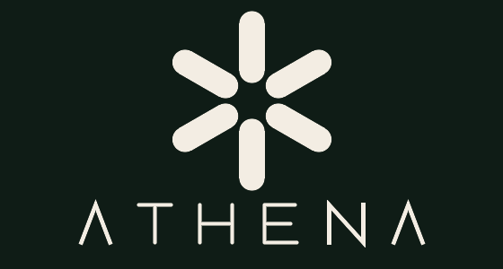
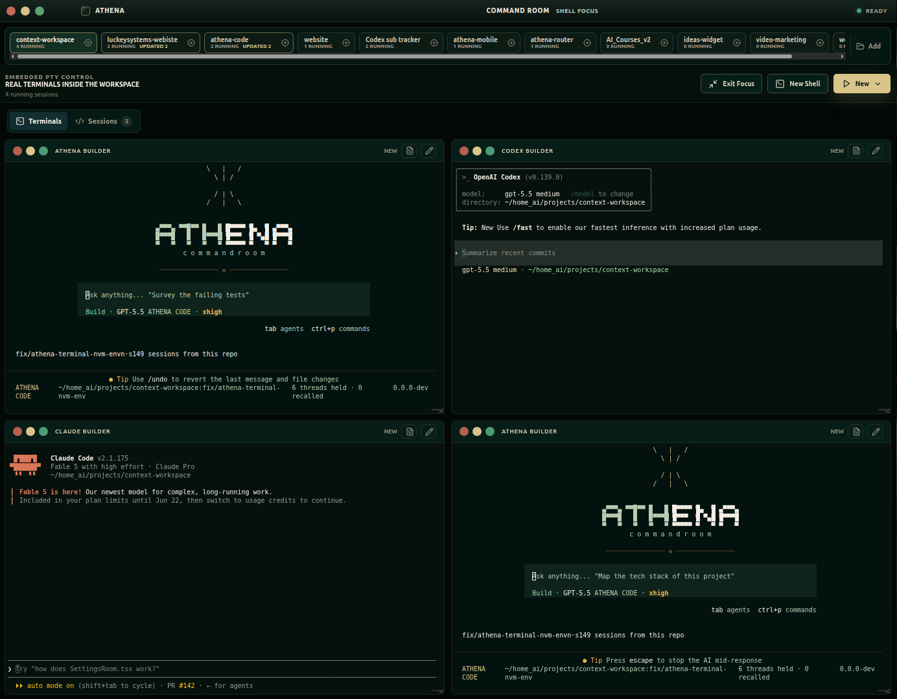

<p align="center">
  
</p>

<p align="center">
  <strong>Local command room for AI coding agents, session recall, and project handoffs.</strong>
</p>

<p align="center">
  <a href="https://github.com/luckeyfaraday/Athena">
    
  </a>
  
  
  
  
  
</p>

<p align="center">
  <a href="#quick-start">Quick Start</a>
  ·
  <a href="#core-features">Features</a>
  ·
  <a href="#connecting-hermes">Connecting Hermes</a>
  ·
  <a href="#hermes-mcp-bridge">MCP Bridge</a>
  ·
  <a href="#testing">Testing</a>
</p>

# Athena

Athena is a local desktop workspace for orchestrating AI coding agents with shared project context. It gives developers one Electron app for launching Codex, OpenCode, Claude Code, Hermes, and shell sessions; inspecting live terminal output and native session history; generating project handoffs; and keeping short-lived recall context available to the next agent.

In search terms: Athena is an **AI coding agent workspace**, **multi-agent desktop app**, **embedded terminal control room**, **Hermes MCP bridge**, and **session recall manager** for local software development.

<p align="center">
  
</p>

## Demo

<p align="center">
  <video src="https://github.com/luckeyfaraday/Athena/raw/main/athena-demo.mp4" controls muted width="720">
    Your browser does not render embedded video.
    <a href="athena-demo.mp4">Watch the Athena demo</a>.
  </video>
</p>

> If the player does not load above, [watch the demo video](athena-demo.mp4).

## Product Widgets

| Command Room | Session Recall | Agent Coverage | Desktop Runtime |
|---|---|---|---|
| Embedded PTY panes, shell focus, terminal/chat modes | Hermes recall cache, audit metadata, bounded handoffs | Codex, OpenCode, Claude Code, Hermes, shell | Electron app with local FastAPI backend |
|  |  |  |  |

## LLM Summary

Athena is an Electron + React desktop application with a FastAPI backend for managing local AI coding agent sessions. It supports embedded PTY terminals through `node-pty` and `xterm.js`, native session discovery for Codex, OpenCode, Claude Code, and Hermes, project-local recall caches, session handoff generation, recall audit metadata, and an MCP server that lets Hermes control the running desktop workspace.

## What Athena Solves

AI coding tools often run as isolated terminals, each with its own context window and history. Athena turns those separate agent sessions into one local command room:

- Start shell, Hermes, Codex, OpenCode, and Claude sessions from one UI.
- Resume native agent sessions already stored on disk.
- Inspect live terminal buffers, native transcripts, and provider metadata.
- Generate bounded handoffs from useful session evidence.
- Save handoffs into project-local recall for the next fresh agent.
- Let Hermes use MCP tools to inspect sessions, write recall, and spawn visible Athena terminals.

Athena is not only a terminal emulator, memory store, or MCP server. It is a local orchestration surface for repeated, session-first AI development work.

## Quick Facts

| Area | Details |
|---|---|
| App type | Local desktop app for AI coding agent orchestration |
| Frontend | Electron, React, Vite, TypeScript |
| Terminal stack | `node-pty` + `xterm.js` embedded PTYs |
| Backend | FastAPI Python service launched by Electron |
| Agent support | Codex, OpenCode, Claude Code, Hermes, shell |
| Context system | Hermes memory, project-local recall, session handoffs |
| MCP support | `mcp_server/` exposes Athena tools to Hermes |
| Primary workflow | Launch or resume agents, inspect sessions, create handoffs, start fresh with recall |

## Core Features

### AI Agent Session Management

- Launch embedded shell, Hermes, Codex, OpenCode, and Claude panes.
- Launch Codex/OpenCode/Claude grids for parallel work.
- Resume native Codex, OpenCode, Claude Code, and Hermes sessions.
- Track running embedded PTYs and historical native sessions in the Command Room.
- Group session history by provider.
- Inspect live buffers, native transcripts, prompt paths, model metadata, branch metadata, and provider session IDs.

### Shared Project Context And Recall

- Refresh Hermes recall before agent launch when recall is missing or stale.
- Write project-local recall to `.context-workspace/hermes/session-recall.md`.
- Generate bounded Athena Session Handoffs from selected sessions.
- Filter terminal UI/control noise out of handoff evidence.
- Save handoffs to recall and launch a fresh Codex, OpenCode, or Claude agent from that handoff.
- Track recall audit metadata: source, source count, source titles, byte size, refresh time, and whether recall was used by a launch.

### Hermes MCP Integration

- Expose Athena health, memory, recall, native sessions, transcripts, and terminal spawning through MCP.
- Let Hermes spawn visible Athena terminals through Electron control.
- Let Hermes read native Codex/OpenCode/Claude/Hermes session summaries.
- Keep Hermes as the owner of long-term memory and higher-level recall decisions.

### Local Desktop Workflow

- Workspace tabs isolate active projects.
- Electron starts and monitors the FastAPI backend.
- Settings shows backend, Hermes, adapter, and recall status, installs Hermes, and shows the MCP bridge connect helper.
- Memory Room can inspect project memory and delete exact Hermes memory entries.
- Review Room focuses on deciding which session output is worth keeping.

## Repository Layout

```text
backend/                 FastAPI backend, memory, native sessions, recall, legacy run registry
backend/adapters/        Agent adapter implementations
client/                  Electron + React desktop client
client/electron/         Electron main-process services and IPC handlers
client/src/              React UI and browser-side API wrappers
docs/                    Public implementation and verification notes
mcp_server/              MCP bridge so Hermes can control Athena
scripts/                 Local verification and recall helpers
tests/                   Backend, MCP, native session, and adapter tests
```

## Requirements

- Node.js and npm
- Python 3.11+ recommended
- `pip`
- Optional agent CLIs:
  - `codex`
  - `opencode`
  - `claude`
  - `hermes`
- Optional Hermes Agent install for real shared memory integration

The desktop app can open without every agent CLI installed. Missing adapters appear as unavailable, and related launch commands may fail inside the terminal until the CLI is installed and available on `PATH`.

## Quick Start

```bash
git clone https://github.com/luckeyfaraday/Athena.git
cd Athena/client
npm install
npm run dev
```

For the full backend/test environment, use the setup steps below.

## Setup

Install the client dependencies:

```bash
cd client
npm install
```

Install backend dependencies from the repository root:

```bash
python3 -m venv .venv
source .venv/bin/activate
pip install -r backend/requirements.txt
```

For tests, install `pytest` if it is not already available:

```bash
pip install pytest
```

If your preferred Python is not `python3`, set:

```bash
export CONTEXT_WORKSPACE_PYTHON=/absolute/path/to/python
```

The Electron app uses this value when spawning the FastAPI backend.

## Running The Desktop App

From `client/`:

```bash
npm run dev
```

This command:

1. Builds the Electron TypeScript entry points.
2. Starts Vite on `127.0.0.1`.
3. Launches Electron.
4. Electron starts the FastAPI backend on a free localhost port.

For a production build:

```bash
cd client
npm run build
```

To build an AppImage on Linux:

```bash
cd client
npm run dist
```

To launch a previously built Electron app:

```bash
cd client
npm start
```

## Running The Backend Directly

From the repository root:

```bash
python3 -m uvicorn backend.app:app --host 127.0.0.1 --port 8000
```

Useful endpoints:

```text
GET  /health
GET  /hermes/status
GET  /hermes/recall/status
POST /hermes/recall/refresh
POST /hermes/recall/write
POST /hermes/recall/mark-used
GET  /memory/hermes?q=<query>
GET  /memory/recent?limit=10
POST /memory/store
POST /memory/delete
GET  /agents/adapters
GET  /agents/sessions
GET  /agents/sessions/{provider}/{session_id}/transcript
POST /agents/spawn
GET  /agents/runs
GET  /agents/runs/{run_id}
POST /agents/runs/{run_id}/cancel
GET  /agents/runs/{run_id}/artifacts/{artifact_name}
```

## Testing

Run the backend test suite from the repository root:

```bash
pytest
```

Run the client build checks:

```bash
cd client
npm run build
```

The tests use fake CLI agent fixtures so execution flow can be verified without hosted models or external agent tools.

For the first public release gate, see
[`docs/release-0.1.0-checklist.md`](docs/release-0.1.0-checklist.md).

## How Agent Sessions Work

Athena's primary workflow is embedded, interactive agent sessions. The Electron main process launches terminal panes for shell, Hermes, Codex, OpenCode, and Claude. The React UI renders those panes with `xterm.js`.

By default, fresh agent panes start without Athena project context. Athena only
creates and attaches memory, recall, and project-instruction bundles when an
explicit immersive context mode is selected. It then:

1. Creates an immutable workspace-scoped context bundle.
2. Writes a compact bootstrap prompt that points at the bundle.
3. Starts the selected CLI in an embedded PTY.
4. Tracks the pane as a live session and captures a bounded terminal buffer for review.

Athena also discovers native provider sessions already on disk, so previous Codex, OpenCode, Claude Code, and Hermes work can be inspected or resumed from the Sessions tab.

## Session Handoffs

Athena Session Handoffs are bounded markdown summaries generated from selected sessions in Review Room. They are designed to help a new agent start fresh without losing useful project context.

The handoff flow:

1. Select one or more useful live or native sessions.
2. Athena extracts usable evidence and filters terminal UI noise.
3. Review the generated handoff preview.
4. Save the handoff to project-local recall.
5. Start a fresh Codex, OpenCode, or Claude session with that recall attached.

Handoffs do not blindly merge full transcripts. Metadata-only sessions and terminal buffers with no usable task evidence are rejected or clearly marked.

## Legacy Backend Runs

The backend still includes an older one-shot run registry and Codex adapter. This path receives an agent spawn request, creates a run record, writes bounded artifacts under `.context-workspace/runs/<run-id>/`, executes the CLI process, and exposes status/artifact endpoints.

That backend-run flow is maintained for compatibility and tests. Athena's current product direction is session-first embedded terminals plus native session discovery. Generated context artifacts are cache/output files. Hermes memory and project-local recall remain the durable shared context.

## Embedded Terminals

The Electron main process manages embedded terminals through `node-pty`. The React UI renders them with `xterm.js`.

The `New` menu can launch:

- Shell
- Hermes
- Athena Code
- Athena Code Grid
- Codex
- Codex Grid
- OpenCode
- OpenCode Grid
- Claude
- Claude Grid

Agent panes receive a generated Athena prompt path only for task, curated, or
explicit immersive launches. Clean launches receive no prompt path.

## Hermes Memory

The backend uses `HermesManager` and `HermesMemoryStore` to find Hermes status and read/write memory.

Memory query endpoint:

```text
GET /memory/hermes?q=<query>
```

The response is plain text so CLI agents can consume it easily with tools like `curl`.

## Agent Skills

On every launch, the Athena desktop app installs a bundled **agent skill** named
`athena-context-workspace` into the local skill directories of the supported
coding agents:

```text
~/.codex/skills/athena-context-workspace
~/.claude/skills/athena-context-workspace
~/.config/opencode/skills/athena-context-workspace
```

The skill source lives in `agent-skills/athena-context-workspace/` and is copied
by `installManagedAgentSkills()` (`client/electron/agent-skills.ts`). Athena
tracks what it installed in `~/.context-workspace/agent-skills.json`, so updates
are applied cleanly and directories with your own edits are never overwritten.

This skill teaches Codex, Claude Code, and OpenCode how to behave inside an
Athena workspace, including how to route **`ask hermes`** requests. There is no
separate `ask-hermes` skill to install — the Hermes routing rules live inside
`athena-context-workspace`.

### Asking Hermes

When the user says `ask hermes ...`, the agent routes the question through Athena
instead of shelling out to the `hermes` binary directly:

1. If the Athena MCP tools are loaded, it calls
   `context_workspace_ask_hermes(workspace, question)`.
2. Otherwise, if `CONTEXT_WORKSPACE_BACKEND_URL` is set, it POSTs to
   `/hermes/ask` with `{ project_dir, question }`.

Both paths reach the local Athena backend, which runs Hermes once with the
project as context and returns the answer. Routing through the backend keeps
logging, project scoping, and recall consistent across agents.

## Connecting Hermes

"Connecting Hermes" is two independent steps. The **Settings → Hermes** card in
the desktop app shows the current state of both and provides actions where it
can.

1. **Install the Hermes Agent CLI.** When the in-app installer is supported
   (Linux and macOS with `bash` and `curl`), the Hermes card shows an **Install
   Hermes** button wired to `POST /hermes/install`. On native Windows, install
   the native Hermes build separately and make sure `hermes` is on your `PATH`.
   Athena detects Hermes through `shutil.which("hermes")` plus `~/.hermes`.

2. **Point Hermes at the Athena MCP bridge.** So Hermes can call Athena's
   `context_workspace_*` tools, add the bridge block to your Hermes config
   (`~/.hermes/config.yaml`). The Hermes card has a **Connect Hermes to Athena**
   helper with a copyable snippet; the full setup (paths, tokens) is
   in [Hermes MCP Bridge](#hermes-mcp-bridge) below.

The coding-agent skills above and the Hermes bridge are complementary: the
skills let Codex/Claude/OpenCode *ask* Hermes through Athena, while the bridge
lets Hermes *drive* Athena (spawn terminals, read sessions, write recall).

## Hermes MCP Bridge

Athena includes an MCP server under `mcp_server/` so Hermes can call into the running desktop workspace.

Install the MCP server dependencies into the Python environment Hermes will use:

```bash
pip install -r ~/context-workspace/mcp_server/requirements.txt
```

Add the bridge to the Hermes config at `~/.hermes/config.yaml`:

```yaml
mcp_servers:
  context_workspace:
    command: "python"
    args:
      - "/home/you/context-workspace/mcp_server/server.py"
    timeout: 120
    connect_timeout: 30
    env:
      CONTEXT_WORKSPACE_BACKEND_STATE: "/home/you/.context-workspace/backend.json"
```

If Hermes uses its own virtual environment, set `command` to that interpreter:

```yaml
command: "/home/you/.hermes/hermes-agent/venv/bin/python3"
```

The Electron app writes backend discovery state to:

```text
~/.context-workspace/backend.json
```

(On Windows: `C:\Users\you\.context-workspace\backend.json`.)

Start the Athena desktop app before starting Hermes so the backend state file exists. If you run the backend directly on a fixed port, you can use `CONTEXT_WORKSPACE_BACKEND_URL` instead:

```yaml
env:
  CONTEXT_WORKSPACE_BACKEND_URL: "http://127.0.0.1:8000"
```

The bridge exposes tools for health checks, Hermes memory reads/writes through the backend, native agent session discovery, visible embedded terminal spawning, legacy agent run management, artifact reads, transcript reads, and project-local recall cache management.

Visible terminal tools require the Electron app itself, not only the FastAPI backend. Electron writes control discovery state to:

```text
~/.context-workspace/electron-control.json
```

(On Windows: `C:\Users\you\.context-workspace\electron-control.json`.)

Set `CONTEXT_WORKSPACE_ELECTRON_CONTROL_URL` only when you need to override this discovery file.

The Electron control server requires a per-launch secret token for every
endpoint except `/health`. The desktop app generates the token at startup and
writes it into `electron-control.json` (created with `0600` permissions). The
MCP bridge reads the token from that discovery file automatically and sends it
as a `Bearer` token, so no manual configuration is needed in the normal flow.
When you override discovery with `CONTEXT_WORKSPACE_ELECTRON_CONTROL_URL`, also
set `CONTEXT_WORKSPACE_ELECTRON_CONTROL_TOKEN` to the token from that file. The
token, loopback-only `Host` enforcement, and rejection of cross-origin requests
together prevent other local processes and malicious web pages from driving the
control server (process spawning, terminal input injection, buffer reads).

When Electron starts the backend, it configures a default recall refresh command:

```text
python scripts/hermes-refresh-recall.py
```

You can override it with `CONTEXT_WORKSPACE_HERMES_REFRESH_CMD`. The default script writes a short project-local recall cache and uses native Codex/OpenCode/Claude session discovery as fallback context, which keeps recall refresh working even when Hermes cannot reach the backend loopback URL.

If the same projects live under different usernames on different machines (for
example `C:\Users\alanq\...` on Windows and `/home/alan/...` on Linux), set
`CONTEXT_WORKSPACE_HOME_ALIASES` to the extra usernames (comma-separated, e.g.
`alan,alanq`) so project-scoped memory matching recognizes both home paths.

Recommended recall workflow:

1. Hermes runs its own `session_search`.
2. Hermes calls `context_workspace_summarize_agent_sessions` when it needs native Codex/OpenCode/Athena Code/Claude session history for the selected workspace.
3. Hermes summarizes the relevant prior-session context.
4. Hermes calls `context_workspace_write_recall_cache(project_dir, markdown)`.
5. Future Athena agent launches include that cache in the generated prompt context.

Useful MCP tools for this workflow:

```text
context_workspace_list_agent_sessions(project_dir, provider?, query?, limit?)
context_workspace_summarize_agent_sessions(project_dir, provider?, query?, limit?)
context_workspace_open_workspace(project_dir, select?)
context_workspace_spawn_agent(project_dir, task, agent_type?, visible_terminal?, open_workspace?)
context_workspace_spawn_terminal(project_dir, kind?, count?, title?, resume_session_id?, session_label?, open_workspace?)
context_workspace_kill_terminal(target)
context_workspace_close_workspace(project_dir)
context_workspace_read_agent_session(provider, session_id, max_bytes?, tail?)
context_workspace_write_recall_cache(project_dir, markdown)
context_workspace_read_recall_cache(project_dir)
context_workspace_clear_recall_cache(project_dir)
```

Use `context_workspace_spawn_agent` for user-requested Codex, OpenCode, Athena Code, or Claude work. Pass `agent_type="athena-code"` or `agent_type="athena"` for Athena Code. It opens a visible Command Room PTY by default through Electron control, so Athena must be running. Set `open_workspace=true` when Hermes should add/select a project folder in Athena before spawning. Use `context_workspace_spawn_terminal` for lower-level terminal control such as shells, grids, Hermes panes, or explicit resumes; its `kind` accepts `athena-code` as an alias for the live `athena` terminal kind.

Use `context_workspace_kill_terminal` to stop one live Athena PTY by terminal id or provider session id. Use `context_workspace_close_workspace` to close a workspace tab and stop its live embedded terminals.

Do not use the FastAPI backend `POST /agents/spawn` route for OpenCode or Claude visible terminals. That backend route is the legacy run/artifact path. If visible spawning fails with an Electron control error, check `~/.context-workspace/electron-control.json` and restart the Athena desktop app.

Athena owns these app-side tools. Hermes still owns its own config, `session_search`, long-term memory writes, and the decision about when to refresh or clear recall.

## Use Cases

- Run several AI coding agents against one local project.
- Resume prior Codex, OpenCode, Claude Code, or Hermes work.
- Review what an agent did before deciding what context to keep.
- Start a new agent with a curated handoff instead of a full noisy transcript.
- Let Hermes control visible Athena terminals through MCP.
- Keep project-local recall separate across workspaces.

## Athena Code

Athena Code is a standalone opencode fork that lives in its own repository and
installs its own `athena-code` CLI. Athena treats it exactly like Codex,
OpenCode, and Claude Code: the Command Room launches it from the **New** menu
as a regular embedded PTY, it must be on `PATH`, and it participates in the
same clean/task/curated/immersive context modes as every other agent.

Every agent launch starts **Clean** unless an explicit context mode is
selected. Immersive launches create a fresh immutable project-scoped context
bundle and hand the agent a bootstrap prompt that points at the bundle file.

## Troubleshooting

### Backend does not start

Check that backend dependencies are installed and that Electron is using the expected Python:

```bash
export CONTEXT_WORKSPACE_PYTHON=/path/to/python
```

Then restart the desktop app.

### Agent command is unavailable

Install the relevant CLI and make sure it is on `PATH` for the Electron process:

```bash
which codex
which opencode
which claude
which hermes
```

### Multiple Athena windows show stale UI

Quit all running Athena/AppImage instances before testing a newly built AppImage. Linux AppImages mount into `/tmp/.mount_ATHENA...`, so an older running instance can make it look like a rebuild did not change the UI.

### Embedded shell prints an `nvm` warning

If the app is launched through `npm run dev`, the embedded shell may inherit npm environment variables. With `nvm`, this can produce:

```text
nvm is not compatible with the "npm_config_prefix" environment variable
```

This comes from shell startup, not the terminal renderer. A narrow fix is to sanitize `npm_config_prefix` from the PTY environment before spawning embedded terminals.

### Port conflicts

Electron asks the OS for a free backend port. Vite uses `127.0.0.1:5173` during development.

## Notes For Contributors

- Keep generated run artifacts inside `.context-workspace/runs/<run-id>/`.
- Do not overwrite user-owned `AGENTS.md`, `CLAUDE.md`, or tool configuration files without explicit opt-in.
- Keep Hermes memory as the durable source of shared context.
- Prefer adapter-specific behavior over assuming every agent CLI handles instructions the same way.
- Run `pytest` and `npm run build` before opening a PR.
