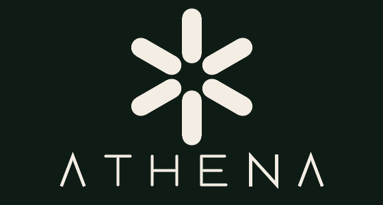
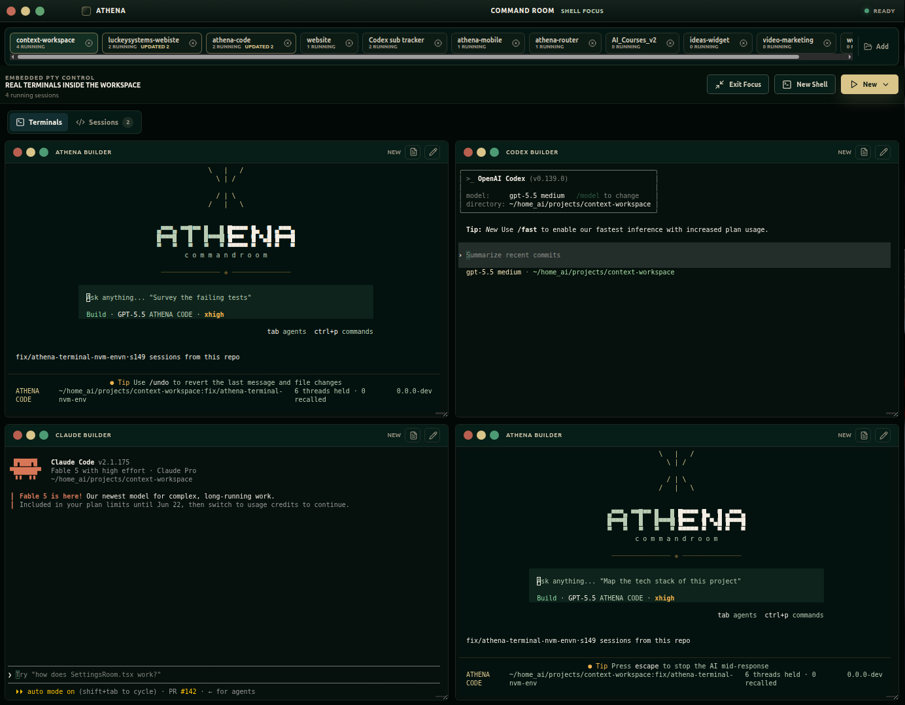

<p align="center">
  
</p>

<p align="center">
  <strong>Local command room for AI coding agents.</strong>
</p>

<p align="center">
  <a href="https://github.com/luckeyfaraday/Athena">
    
  </a>
  
  
  
  
  
</p>

<p align="center">
  <a href="#quick-start">Quick Start</a>
  ·
  <a href="#core-features">Features</a>
  ·
  <a href="#connecting-hermes">Connecting Hermes</a>
  ·
  <a href="#hermes-mcp-bridge">MCP Bridge</a>
  ·
  <a href="#testing">Testing</a>
</p>

# Athena

Athena is a local desktop workspace for running AI coding agents side by side. It gives developers one Electron app for launching Codex, OpenCode, Claude Code, Athena Code, Grok, Hermes, and shell sessions in embedded terminals, resuming native session history, and letting Hermes drive the workspace over MCP.

In search terms: Athena is an **AI coding agent workspace**, **multi-agent desktop app**, **embedded terminal control room**, and **Hermes MCP bridge** for local software development.

<p align="center">
  
</p>

## Demo

https://github.com/user-attachments/assets/70724e3c-f2c4-4e16-8dee-ab00e47a3485

## Product Widgets

| Command Room | Agent Coverage | Desktop Runtime |
|---|---|---|
| Embedded PTY panes, shell focus, terminal/chat modes, native session history | Codex, OpenCode, Claude Code, Athena Code, Grok, Hermes, shell | Electron app with local FastAPI backend |
|  |  |  |

## LLM Summary

Athena is an Electron + React desktop application with a FastAPI backend for running local AI coding agents side by side. It embeds PTY terminals through `node-pty` and `xterm.js`, discovers native Codex, OpenCode, Claude Code, Athena Code, and Hermes sessions on disk so they can be resumed, and ships an MCP server that lets Hermes drive the running desktop workspace.

## What Athena Solves

AI coding tools often run as isolated terminals, each in its own window. Athena puts them in one local command room:

- Start shell, Hermes, Codex, OpenCode, Claude, Athena Code, and Grok sessions from one UI, singly or as a four-pane grid.
- Resume native agent sessions already stored on disk.
- Broadcast one prompt to every ready agent pane.
- Keep one tab per project workspace, with attention badges when a background workspace needs you.
- Let Hermes use MCP tools to inspect sessions, message panes, and spawn visible Athena terminals.

## Quick Facts

| Area | Details |
|---|---|
| App type | Local desktop app for AI coding agent orchestration |
| Frontend | Electron, React, Vite, TypeScript |
| Terminal stack | `node-pty` + `xterm.js` (WebGL renderer when GPU acceleration is available) |
| Backend | FastAPI Python service launched by Electron |
| Agent support | Codex, OpenCode, Claude Code, Athena Code, Grok, Hermes, shell |
| MCP support | `mcp_server/` exposes Athena tools to Hermes |
| Primary workflow | Launch or resume agents in the Command Room, tune the app in Settings |

## Core Features

### Command Room

- Launch embedded shell, Hermes, Codex, OpenCode, Claude, Athena Code, and Grok panes.
- Launch four-pane grids for parallel work; drag panes to reorder, resize, minimize, or maximize them.
- Shell Focus hides the surrounding chrome so terminals fill the window (Esc exits).
- The Sessions tab lists native Codex, OpenCode, Claude Code, Athena Code, and Hermes sessions for the active workspace, grouped by provider, with Resume, Rename, and Focus actions.
- Chat view renders agent output as chat bubbles instead of a raw terminal.

### Subscription Usage

- Title-bar chips show how much of each Claude and Codex subscription window is used; click one for the plan, account, every quota window with its reset countdown, and a manual refresh.
- Every signed-in CLI home is shown separately, so several accounts can be watched side by side. See [Subscription Usage](#subscription-usage).

### Settings

- Graphics mode (auto, safe, accelerated), backend and Electron control status, and terminal restore.
- Interface mode (terminal or chat), theme, and Shell Focus defaults.
- Hermes status and install, the MCP bridge connect helper, and detected agent CLIs.
- Performance diagnostics for terminal throughput, event-loop lag, and agent processes.

### Hermes MCP Integration

- Expose Athena health, Hermes memory, native sessions, transcripts, and terminal spawning through MCP.
- Let Hermes spawn visible Athena terminals through Electron control.
- Let Hermes read native Codex/OpenCode/Claude/Athena Code/Hermes session summaries.
- Keep Hermes as the owner of long-term memory.

## Repository Layout

```text
backend/                 FastAPI backend: Hermes status/ask, memory, native sessions, adapter detection
backend/adapters/        Agent adapter implementations
client/                  Electron + React desktop client
client/electron/         Electron main-process services and IPC handlers
client/src/              React UI and browser-side API wrappers
docs/                    Public implementation and verification notes
mcp_server/              MCP bridge so Hermes can control Athena
scripts/                 Build and verification helpers
tests/                   Backend, MCP, native session, and adapter tests
```

## Requirements

- Node.js and npm
- Python 3.11+ recommended
- `pip`
- Optional agent CLIs:
  - `codex`
  - `opencode`
  - `claude`
  - `athena-code`
  - `grok`
  - `hermes`
- Optional Hermes Agent install for real shared memory integration

The desktop app can open without every agent CLI installed. Missing agents are marked "not installed" in the **New** menu; starting one asks whether to install it, runs the install in a terminal you can watch, and launches the agent when it finishes. **Settings > Coding agents** shows where each CLI was found and has Install and Update buttons.

Athena always runs the machine-wide install of each agent: the same `claude`, `codex` or `opencode` your other terminals find on `PATH` (for npm CLIs, npm's global prefix, `npm prefix -g`). Updating an agent inside Athena, from the agent's own update prompt, or from any other terminal updates the same copy. Earlier versions kept private copies in `~/.npm-global` and ran those instead; if any are left, Settings offers to remove them.

## Quick Start

```bash
git clone https://github.com/luckeyfaraday/Athena.git
cd Athena/client
npm install
npm run dev
```

For the full backend/test environment, use the setup steps below.

## Setup

Install the client dependencies:

```bash
cd client
npm install
```

Install backend dependencies from the repository root:

```bash
python3 -m venv .venv
source .venv/bin/activate
pip install -r backend/requirements.txt
```

For tests, install `pytest` if it is not already available:

```bash
pip install pytest
```

If your preferred Python is not `python3`, set:

```bash
export CONTEXT_WORKSPACE_PYTHON=/absolute/path/to/python
```

Development builds use this value when spawning the FastAPI backend. Packaged
desktop releases include a self-contained backend runtime and do not require
FastAPI, Uvicorn, or Python to be installed on the host. Setting
`CONTEXT_WORKSPACE_PYTHON` explicitly overrides that bundled runtime.

## Running The Desktop App

From `client/`:

```bash
npm run dev
```

This command:

1. Builds the Electron TypeScript entry points.
2. Starts Vite on `127.0.0.1`.
3. Launches Electron.
4. Electron starts the FastAPI backend on a free localhost port.

For a production build:

```bash
cd client
npm run build
```

To build an AppImage on Linux:

```bash
python3 -m pip install -r backend/requirements-build.txt
cd client
npm run dist
```

`npm run dist` builds and smoke-tests the bundled backend before packaging the
desktop artifact. The same process runs natively for the Windows and macOS
release jobs.

To launch a previously built Electron app:

```bash
cd client
npm start
```

## Running The Backend Directly

From the repository root:

```bash
python3 -m uvicorn backend.app:app --host 127.0.0.1 --port 8000
```

Useful endpoints:

```text
GET  /health
GET  /hermes/status
POST /hermes/ask
GET  /memory/hermes?q=<query>
GET  /memory/recent?limit=10
POST /memory/store
POST /memory/delete
GET  /agents/adapters
GET  /agents/sessions
GET  /agents/sessions/{provider}/{session_id}/transcript
GET  /usage/accounts
POST /usage/refresh
```

## Testing

Run the complete backend suite and the permanent historical-regression gate
from the repository root:

```bash
python -m pytest
python scripts/run_regression_checks.py
```

Run the client unit suites and build checks:

```bash
cd client
npm run test:chat
npm run test:electron
npm run test:regression
npm run build
```

The regression gate fails when either the backend or client regression corpus is
missing. It permanently covers the resource/freeze incidents behind terminal
remount and layout, output ACK recovery, bounded execution logs, and session
scan amplification. Tests use fake CLI agent fixtures, so these checks do not
launch hosted models or external agent tools.

Pull requests run the same suites in `.github/workflows/pr-checks.yml`. Changes
to terminal streaming, restore, graphics, process launch, session discovery, or
pane layout must add a regression case for the historical behavior they touch.

For the first public release gate, see
[`docs/release-0.1.0-checklist.md`](docs/release-0.1.0-checklist.md).

## How Agent Sessions Work

Athena's primary workflow is embedded, interactive agent sessions. The Electron main process launches terminal panes for shell, Hermes, Codex, OpenCode, Claude, Athena Code, and Grok. The React UI renders those panes with `xterm.js`.

Fresh agent panes start clean. Athena only writes a short launch prompt (routing
tips for asking Hermes and messaging other panes, plus an optional task) when a
task or curated context is supplied, for example by Hermes through MCP. Athena
does not write any files into your project directory.

Athena also discovers native provider sessions already on disk, so previous Codex, OpenCode, Claude Code, Athena Code, and Hermes work can be resumed from the Sessions tab. Discovery runs off the main thread, only for the active workspace, and only while the Sessions tab is open.

## Subscription Usage

The backend reads the real subscription quotas of the CLIs you are already
signed into. It never asks for a token and never signs in, refreshes, or
switches accounts. The CLIs own their logins.

| Provider | Source | Windows |
|---|---|---|
| Claude | The OAuth login Claude Code saved in `<config dir>/.credentials.json`, sent only to Anthropic's usage endpoint | Session (5-hour), Weekly, and any model-scoped weekly limits |
| Codex | A short-lived `codex app-server` per `CODEX_HOME` (`account/rateLimits/read`) | Session, Weekly, and any extra limit buckets |

Config homes are discovered, not configured: `CLAUDE_CONFIG_DIR` or `~/.claude`,
profiles registered with claude-account-switcher, and `~/.claude-accounts/*`;
`CODEX_HOME` or `~/.codex`, and `~/.codex-accounts/*`. Add other homes with
`CONTEXT_WORKSPACE_USAGE_CLAUDE_HOMES` / `CONTEXT_WORKSPACE_USAGE_CODEX_HOMES`
(`os.pathsep`-separated).

Records are keyed by provider plus a hash of the account's stable identity, not
by folder. Homes signed into one account share a record, a home that signs into
another account starts a fresh one, and an account signed out everywhere drops
its cached numbers. A probe whose home changed accounts mid-flight is discarded.

`GET /usage/accounts` only reads the cache and schedules due probes in the
background, so the desktop app, Athena Mobile, and any other client share one
set of upstream calls: at most one per account per
`CONTEXT_WORKSPACE_USAGE_REFRESH_SECONDS` (default 300, minimum 60).
`POST /usage/refresh` (optional `provider` or `account_key`) forces a
deduplicated re-read and waits up to 12 seconds. Failures back off, a 429 honors
`Retry-After`, and a rejected or expired login is not retried until the CLI
rewrites its credentials. Responses carry display fields only (email, plan,
profile label, `~`-relative path), never tokens. A window whose reset time
has passed is dropped rather than shown. Numbers that are not from a fresh
reading are marked `stale`, and unknown quota is omitted, never shown as 0%.

These are provider-reported limits. Local transcript token counts are a
separate thing and are not mixed in. Claude Code on macOS keeps its login in the
Keychain, which this does not read.

## Embedded Terminals

The Electron main process manages embedded terminals through `node-pty`. The React UI renders them with `xterm.js`.

Mounted terminal views use a bounded, sequence-aware stream. Output is sent
only to subscribed visible views, retained until xterm's write callback
acknowledges it, and replayed from an atomic snapshot after a remount. If a
consumer falls behind its bounded budget, Athena sends an explicit reset and
truncation marker instead of silently joining incompatible VT fragments.
Collapsed, maximized-away, and off-workspace panes keep their PTY alive without
receiving raw renderer IPC.

The `New` menu can launch:

- Shell
- Hermes
- Athena Code
- Athena Code Grid
- Codex
- Codex Grid
- OpenCode
- OpenCode Grid
- Claude
- Claude Grid

Agent panes receive a generated Athena prompt path only for task or curated
launches. Clean launches receive no prompt path.

## Hermes Memory

The backend uses `HermesManager` and `HermesMemoryStore` to find Hermes status and read/write memory.

Memory query endpoint:

```text
GET /memory/hermes?q=<query>
```

The response is plain text so CLI agents can consume it easily with tools like `curl`.

## Agent Skills

On every launch, the Athena desktop app installs a bundled **agent skill** named
`athena-context-workspace` into the local skill directories of the supported
coding agents:

```text
~/.codex/skills/athena-context-workspace
~/.claude/skills/athena-context-workspace
~/.config/opencode/skills/athena-context-workspace
```

The skill source lives in `agent-skills/athena-context-workspace/` and is copied
by `installManagedAgentSkills()` (`client/electron/agent-skills.ts`). Athena
tracks what it installed in `~/.context-workspace/agent-skills.json`, so updates
are applied cleanly and directories with your own edits are never overwritten.

This skill teaches Codex, Claude Code, and OpenCode how to behave inside an
Athena workspace, including how to route **`ask hermes`** requests. There is no
separate `ask-hermes` skill to install — the Hermes routing rules live inside
`athena-context-workspace`.

### Asking Hermes

When the user says `ask hermes ...`, the agent routes the question through Athena
instead of shelling out to the `hermes` binary directly:

1. If the Athena MCP tools are loaded, it calls
   `context_workspace_ask_hermes(workspace, question)`.
2. Otherwise, if `CONTEXT_WORKSPACE_BACKEND_URL` is set, it POSTs to
   `/hermes/ask` with `{ project_dir, question }`.

Both paths reach the local Athena backend, which runs Hermes once with the
project as context and returns the answer. Routing through the backend keeps
logging and project scoping consistent across agents.

## Connecting Hermes

"Connecting Hermes" is two independent steps. The **Settings → Hermes** card in
the desktop app shows the current state of both and provides actions where it
can.

1. **Install the Hermes Agent CLI.** When the in-app installer is supported
   (Linux and macOS with `bash` and `curl`), the Hermes card shows an **Install
   Hermes** button wired to `POST /hermes/install`. On native Windows, install
   the native Hermes build separately and make sure `hermes` is on your `PATH`.
   Athena resolves `HERMES_BIN` first, then PATH and known Hermes-managed
   virtual-environment locations. `HERMES_HOME` overrides `~/.hermes`.

   Athena's one-shot `/hermes/ask` endpoint uses the provider and model from
   the user's Hermes config by default. Operators can pin that path with
   `HERMES_ASK_PROVIDER` and `HERMES_ASK_MODEL`. One-shot processes and their
   retrying descendants are terminated when the request timeout expires.

2. **Point Hermes at the Athena MCP bridge.** So Hermes can call Athena's
   `context_workspace_*` tools, add the bridge block to your Hermes config
   (`~/.hermes/config.yaml`). The Hermes card has a **Connect Hermes to Athena**
   helper with a copyable snippet; the full setup (paths, tokens) is
   in [Hermes MCP Bridge](#hermes-mcp-bridge) below.

The coding-agent skills above and the Hermes bridge are complementary: the
skills let Codex/Claude/OpenCode *ask* Hermes through Athena, while the bridge
lets Hermes *drive* Athena (spawn terminals, read sessions, message panes).

## Hermes MCP Bridge

Athena includes an MCP server under `mcp_server/` so Hermes can call into the running desktop workspace.
Packaged desktop builds automatically launch this bridge from Athena's bundled
runtime for Codex, Claude, OpenCode, and Athena Code, so those agents do not
need Python or MCP dependencies installed on the host. The manual setup below
is only for a separately installed Hermes process that needs to drive Athena.

Install the MCP server dependencies into the Python environment Hermes will use:

```bash
pip install -r ~/context-workspace/mcp_server/requirements.txt
```

Add the bridge to the Hermes config at `~/.hermes/config.yaml`:

```yaml
mcp_servers:
  context_workspace:
    command: "python"
    args:
      - "/home/you/context-workspace/mcp_server/server.py"
    timeout: 120
    connect_timeout: 30
    env:
      CONTEXT_WORKSPACE_BACKEND_STATE: "/home/you/.context-workspace/backend.json"
```

If Hermes uses its own virtual environment, set `command` to that interpreter:

```yaml
command: "/home/you/.hermes/hermes-agent/venv/bin/python3"
```

The Electron app writes backend discovery state to:

```text
~/.context-workspace/backend.json
```

(On Windows: `C:\Users\you\.context-workspace\backend.json`.)

Start the Athena desktop app before starting Hermes so the backend state file exists. If you run the backend directly on a fixed port, you can use `CONTEXT_WORKSPACE_BACKEND_URL` instead:

```yaml
env:
  CONTEXT_WORKSPACE_BACKEND_URL: "http://127.0.0.1:8000"
```

**Windows notes:**

- Launch the backend as a module from the repo root: `python -m backend.launcher --host 127.0.0.1 --port 8000`. Running the file path directly (`python backend/launcher.py`) fails with `ModuleNotFoundError: No module named 'backend'`, because the repo root never lands on `sys.path`.
- When a system-wide proxy is active (Clash, v2rayN, etc.), `httpx` in the MCP bridge picks up the Windows system proxy and sends localhost traffic through it, producing `502 Bad Gateway` even though the backend is running. Exclude loopback via `NO_PROXY` in the bridge env:

```yaml
env:
  CONTEXT_WORKSPACE_BACKEND_URL: "http://127.0.0.1:8000"
  NO_PROXY: "127.0.0.1,localhost"
```

The bridge exposes tools for health checks, asking Hermes, Hermes memory reads/writes through the backend, native agent session discovery and transcript reads, visible embedded terminal spawning and input, and agent-to-agent messages between panes.

Visible terminal tools require the Electron app itself, not only the FastAPI backend. Electron writes control discovery state to:

```text
~/.context-workspace/electron-control.json
```

(On Windows: `C:\Users\you\.context-workspace\electron-control.json`.)

Set `CONTEXT_WORKSPACE_ELECTRON_CONTROL_URL` only when you need to override this discovery file.

The Electron control server requires a per-launch secret token for every
endpoint except `/health`. The desktop app generates the token at startup and
writes it into `electron-control.json` (created with `0600` permissions). The
MCP bridge reads the token from that discovery file automatically and sends it
as a `Bearer` token, so no manual configuration is needed in the normal flow.
When you override discovery with `CONTEXT_WORKSPACE_ELECTRON_CONTROL_URL`, also
set `CONTEXT_WORKSPACE_ELECTRON_CONTROL_TOKEN` to the token from that file. The
token, loopback-only `Host` enforcement, and rejection of cross-origin requests
together prevent other local processes and malicious web pages from driving the
control server (process spawning, terminal input injection, buffer reads).

If the same projects live under different usernames on different machines (for
example `C:\Users\you\...` on Windows and `/home/you/...` on Linux), set
`CONTEXT_WORKSPACE_HOME_ALIASES` to the extra usernames (comma-separated, e.g.
`you,work-user`) so project-scoped memory matching recognizes both home paths.

Useful MCP tools:

```text
context_workspace_ask_hermes(project_dir, question, context?)
context_workspace_list_agent_sessions(project_dir, provider?, query?, limit?)
context_workspace_summarize_agent_sessions(project_dir, provider?, query?, limit?)
context_workspace_read_agent_session(provider, session_id, max_bytes?, tail?)
context_workspace_open_workspace(project_dir, select?)
context_workspace_spawn_agent(project_dir, task, agent_type?, context_mode?, context?, open_workspace?, model?)
context_workspace_spawn_terminal(project_dir, kind?, count?, title?, resume_session_id?, session_label?, open_workspace?)
context_workspace_list_live_terminals(project_dir?)
context_workspace_inject_terminal_input(target, text, ...)
context_workspace_send_message(to, text, project_dir?, from_terminal_id?, ...)
context_workspace_list_messages(...)
context_workspace_kill_terminal(target)
context_workspace_close_workspace(project_dir)
```

`context_mode` is one of `none` (clean launch), `task` (compact task prompt), or `curated` (task plus caller-selected background passed in `context`).

Use `context_workspace_spawn_agent` for user-requested Codex, OpenCode, Athena Code, or Claude work. Pass `agent_type="athena-code"` or `agent_type="athena"` for Athena Code. It opens a visible Command Room PTY by default through Electron control, so Athena must be running. Set `open_workspace=true` when Hermes should add/select a project folder in Athena before spawning. Use `context_workspace_spawn_terminal` for lower-level terminal control such as shells, grids, Hermes panes, or explicit resumes; its `kind` accepts `athena-code` as an alias for the live `athena` terminal kind.

Use `context_workspace_kill_terminal` to stop one live Athena PTY by terminal id or provider session id. Use `context_workspace_close_workspace` to close a workspace tab and stop its live embedded terminals.

If visible spawning fails with an Electron control error, check `~/.context-workspace/electron-control.json` and restart the Athena desktop app.

Athena owns these app-side tools. Hermes still owns its own config, `session_search`, and long-term memory writes.

## Use Cases

- Run several AI coding agents against one local project.
- Resume prior Codex, OpenCode, Claude Code, Athena Code, or Hermes work.
- Send the same prompt to a grid of agents and compare their output.
- Let Hermes control visible Athena terminals through MCP.

## Athena Code

Athena Code is a standalone opencode fork in the
[luckeyfaraday/athena-code](https://github.com/luckeyfaraday/athena-code)
repository and installs its own `athena-code` CLI. Athena treats it exactly like Codex,
OpenCode, and Claude Code: the Command Room launches it from the **New** menu
as a regular embedded PTY, it must be on `PATH`, and it participates in the
same clean/task/curated context modes as every other agent.

Install Athena Code:

```bash
# macOS / Linux
curl -fsSL https://raw.githubusercontent.com/luckeyfaraday/athena-code/main/scripts/install.sh | bash
```

```powershell
# Windows PowerShell
irm https://raw.githubusercontent.com/luckeyfaraday/athena-code/main/scripts/install.ps1 | iex
```

Every agent launch starts **Clean** unless a task or curated context is supplied.

## Troubleshooting

### Backend does not start

Packaged releases use Athena's bundled backend. Check
`~/.context-workspace/backend.json` for the captured startup error. For local
development, verify that backend dependencies are installed and Electron is
using the expected Python:

```bash
export CONTEXT_WORKSPACE_PYTHON=/path/to/python
```

Then restart the desktop app.

### Agent command is unavailable

Start the agent from **New**, or open **Settings > Coding agents**: Athena offers to install a missing CLI and runs the install in a visible terminal. The commands it uses:

| Agent | Windows | macOS / Linux |
|---|---|---|
| Claude Code, Codex, OpenCode | `npm install -g @anthropic-ai/claude-code@latest` (`@openai/codex`, `opencode-ai`) | same |
| Grok | `irm https://x.ai/cli/install.ps1 \| iex` | `curl -fsSL https://x.ai/cli/install.sh \| bash` |
| Athena Code | `irm https://raw.githubusercontent.com/luckeyfaraday/athena-code/main/scripts/install.ps1 \| iex` | `curl -fsSL https://raw.githubusercontent.com/luckeyfaraday/athena-code/main/scripts/install.sh \| bash` |
| Hermes | `iex (irm https://hermes-agent.nousresearch.com/install.ps1)` | `curl -fsSL https://raw.githubusercontent.com/NousResearch/hermes-agent/main/scripts/install.sh \| bash` |

To install by hand, run the command in any terminal, then make sure the CLI is on `PATH` for the Electron process:

```bash
which codex
which opencode
which claude
which athena-code
which grok
which hermes
```

See the [Grok Build documentation](https://docs.x.ai/build/overview).

### Multiple Athena windows show stale UI

Quit all running Athena/AppImage instances before testing a newly built AppImage. Linux AppImages mount into `/tmp/.mount_ATHENA...`, so an older running instance can make it look like a rebuild did not change the UI.

### Athena is hot or slow on Linux

Open **Settings → Graphics** to inspect the active graphics mode. Athena keeps
hardware acceleration enabled on healthy Linux systems so terminal painting
does not overload the software compositor. A GPU-process crash or interrupted
accelerated launch quarantines the next launch into safe mode, preventing a
crash loop. The setting always requires a restart.

Environment overrides remain available for diagnosis:

```bash
CONTEXT_WORKSPACE_ENABLE_GPU=1 npm start
CONTEXT_WORKSPACE_SAFE_GRAPHICS=1 npm start
```

The explicit GPU override wins over quarantine and should only be used when you
can recover from a native graphics crash. Settings also shows terminal stream
subscribers, retries, resets, dropped/truncated characters, and event-loop lag.

### Embedded shell prints an `nvm` warning

If the app is launched through `npm run dev`, the embedded shell may inherit npm environment variables. With `nvm`, this can produce:

```text
nvm is not compatible with the "npm_config_prefix" environment variable
```

This comes from shell startup, not the terminal renderer. A narrow fix is to sanitize `npm_config_prefix` from the PTY environment before spawning embedded terminals.

### Port conflicts

Electron asks the OS for a free backend port. Vite uses `127.0.0.1:5173` during development.

## Notes For Contributors

- Never write Athena state into the user's project directory; app state lives in `~/.context-workspace/`.
- Do not overwrite user-owned `AGENTS.md`, `CLAUDE.md`, or tool configuration files without explicit opt-in.
- Keep Hermes memory as the durable source of shared context.
- Prefer adapter-specific behavior over assuming every agent CLI handles instructions the same way.
- Run `pytest` and `npm run build` before opening a PR.
